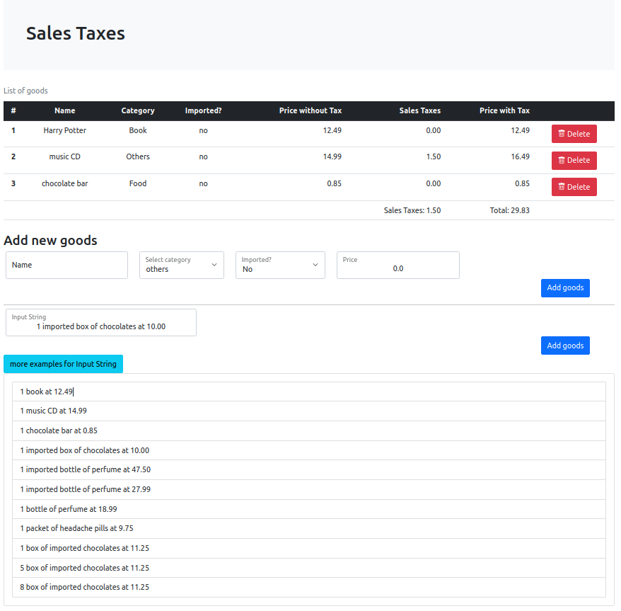

# Sales Taxes

### Preview



## How to run the application?
In order to run the application you need to have Docker and docker-compose installed on your machine. Execute the following command:

```sh
docker-compose up
```

Then open the web page `http://localhost:8080` in a browser.
